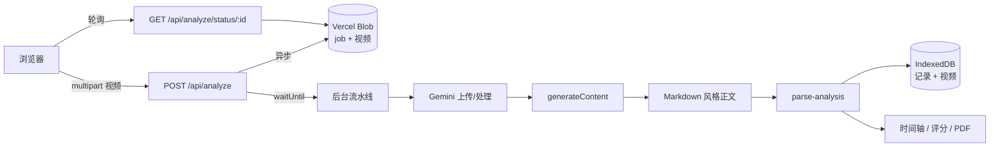

# CRUX 抱石 · AI 攀爬动作分析

面向 **AI 应用 / LLM 工程** 的全栈项目：将用户上传的抱石视频送入多模态大模型，产出带时间戳的结构化教练反馈，并完成解析、展示与 PDF 导出。

> **演示说明**：线上部署在 Vercel（境外节点），国内网络可能无法稳定打开。面试/作品集请以 **本仓库 + 演示视频** 为主（见下方「演示材料」）。

---

## AI 能力亮点（简历可讲）

| 模块 | 做法 |
|------|------|
| **多模态输入** | 攀爬视频 → Gemini File API 上传 → `generateContent` 视频理解 |
| **Prompt 工程** | 中/英双语教练人设；轻量/深度两种输出约束；`PROMPT_VERSION` 版本化便于回归对比 |
| **结构化输出** | 正则 + 分段解析 `[MM:SS]` 时间轴、评分、难度、维度总结与改进要点 |
| **可靠性** | 429/RPM/日配额分类处理；空响应检测；后台 `waitUntil` + Job 状态机跨轮询重试 |
| **Serverless 约束** | 客户端压缩至 3.5MB；异步 Blob 任务规避 60s 超时；进度轮询 UX |
| **产品化** | 分析深度 / AI 输出语言与界面语言解耦；PDF 单页报告（html2canvas 规避 oklab） |

---

## 架构概览



---

## 技术栈

- **框架**：Next.js 16（App Router）、React 19、TypeScript  
- **AI**：Google Gemini（`gemini-2.5-flash`，可 `GEMINI_MODEL` 覆盖）  
- **异步任务**：Vercel Blob、`@vercel/functions` waitUntil  
- **客户端**：IndexedDB 历史、视频压缩、html2canvas + jsPDF  
- **账户（可选）**：JWT Session + Vercel Postgres（Neon）  

---

## 功能一览

- 上传 / 拖拽视频，自动压缩后分析  
- 线路难度 V 级、爬升高度、备注  
- 分析深度（轻量 / 深度）、AI 输出中/英  
- 结构化结果页：评分、时间轴、收藏片段、Markdown/PDF 导出  
- 进步统计、历史筛选、昼夜主题  

---

## 本地运行

```bash
git clone <your-repo-url>
cd my-bouldering-ai
npm install
cp .env.example .env.local
```

`.env.local` 至少配置：

```env
GEMINI_API_KEY=你的密钥
# 部署异步分析时建议：
BLOB_READ_WRITE_TOKEN=...
# 可选：注册登录
POSTGRES_URL=...
AUTH_SECRET=...
```

```bash
npm run dev
# http://localhost:3000
```

---

## 演示材料（建议放在简历里）

| 材料 | 说明 |
|------|------|
| **GitHub 本仓库** | 国内可访问，主链接 |
| **演示视频（请你录制 1～2 分钟）** | 上传后把链接填到下方 |
| 在线 Demo | `https://bouldering-ai-coach.vercel.app`（境外，仅作参考） |

**演示视频占位**（替换为你的链接）：

```text
演示视频：https://（B站 / 网盘 / 飞书）
```

**截图**：将 3～5 张界面截图放入 `docs/screenshots/`，在本 README 中引用（见下方示例）。

```markdown


```

---

## 关键代码索引（面试快速定位）

| 主题 | 路径 |
|------|------|
| Prompt 与版本 | `lib/analyze-prompt.ts` |
| Gemini 调用与重试 | `lib/gemini-analyze.ts`, `lib/gemini-retry.ts`, `lib/gemini-phases.ts` |
| 异步 Job 流水线 | `lib/process-analysis-job.ts`, `lib/analysis-jobs.ts` |
| 输出解析 | `lib/parse-analysis.ts`, `lib/parse-structured-report.ts` |
| API 入口 | `app/api/analyze/route.ts` |
| 前端分析流程 | `app/analyze/page.tsx` |

更完整的设计说明见 **[docs/DESIGN.md](./docs/DESIGN.md)**。  
产品需求见 **[docs/PRD.md](./docs/PRD.md)**。  
简历项目描述见 **[docs/RESUME-AI.md](./docs/RESUME-AI.md)**。

---

## 已知限制与可扩展

- 线上托管在 Vercel，国内访问不稳定 → 作品集以 GitHub + 录屏为主  
- 分析历史存于浏览器 IndexedDB，未全量上云  
- 模型绑定 Gemini；可抽象 `AnalyzeProvider` 接入 OpenAI / 国产 VL API  
- 免费 API 配额限制并发与日均分析次数  

---

## License

MIT

---

## 桌面客户端（Electron + React + TypeScript）

除网页版外，仓库还提供 Windows 桌面客户端，见 **[desktop/](./desktop/README.md)**。它把 Next.js 的服务端能力搬到 Electron 主进程：

- **默认接入 DeepSeek**：走 `deepseek-flash` 图像理解，国内直连、不依赖 Vercel，也无需代理；可在设置里一键切回 Google Gemini（直接上传视频）
- **DeepSeek 不支持视频 → 本地抽帧**：客户端按时间均匀抽取关键帧并给每帧打上 `[MM:SS]` 时间戳，因此仍能产出时间轴级别的教练点评
- **API Key 本机保存**：应用内「设置」页填写，只写入本机 `userData`；两家的 Key 与模型分别保存
- **能力对齐网页版**：上传压缩、四阶段进度、限流自动重试、结构化报告、时间轴收藏、PDF / Markdown 导出、深浅色主题、中英界面
- **复用同一份核心逻辑**：直接引用根目录 `lib/` 的 Prompt、Gemini 调用、解析与统计模块

```bash
cd desktop
npm install
npm run dev          # 开发模式
npm test             # 单元 / 组件 / 流程集成测试
npm run test:e2e     # 真实 Electron 端到端测试
npm run dist         # 打包 Windows 安装包
```
